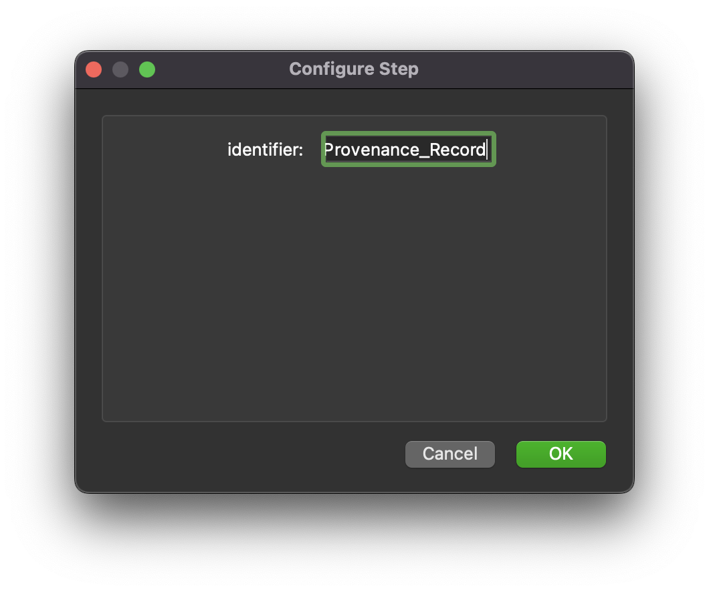

MAP Client Plugin - MAP Client Provenance Record
================================================

The **MAP Client Provenance Record** is MAP Client plugin for providing a Python dictionary containing the provenance record for the MAP Client instance currently in use.

.. _fig-mcp-map-client-provenance-record-configured-step:

   A configured *MAP Client Provenance Record* step icon.

Configure
---------

This step is used for providing a record of the provenance information about MAP Client.
As such this step does not require any configuration.
The provenance record is provided as a Python dict suitable for serialisation into JSON format.

.. _fig-mcp-map-client-provenance-record-configure-dialog:

   *MAP Client Provenance Record* step configuration dialog.

Ports
-----

This plugin:

* **provides**:

  * *http://physiomeproject.org/workflow/1.0/rdf-schema#dict*
