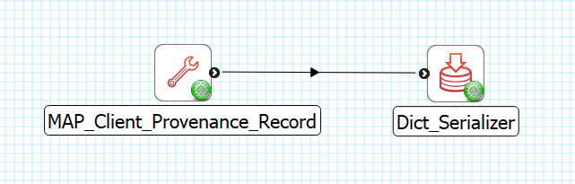

MAP Client Provenance Record
============================

The **MAP Client Provenance Record** is MAP Client plugin for providing a Python dictionary containing the provenance record for the MAP Client instance currently in use.

Workflow Connections
--------------------

As shown in :numref:`fig-mcp-map-client-provenance-record-workflow-connections`, the **MAP Client Provenance Record** does not need any input.

It produces 1 output which may be piped to other workflow steps:

1. A Python dictionary suitable for serialisation into JSON format. (Port: *http://physiomeproject.org/workflow/1.0/rdf-schema#dict*) 

.. _fig-mcp-map-client-provenance-record-workflow-connections:

   **MAP Client Provenance Record** workflow connections.

Configure
---------

This step is used for providing a record of the provenance information about MAP Client.
As such this step does not require any configuration.
The provenance record is provided as a Python dict suitable for serialisation into JSON format.

.. _fig-mcp-map-client-provenance-record-configure-dialog:

.. figure:: _images/step-configuration-dialog.png
   :alt: Step configure dialog

   *MAP Client Provenance Record* step configuration dialog.
